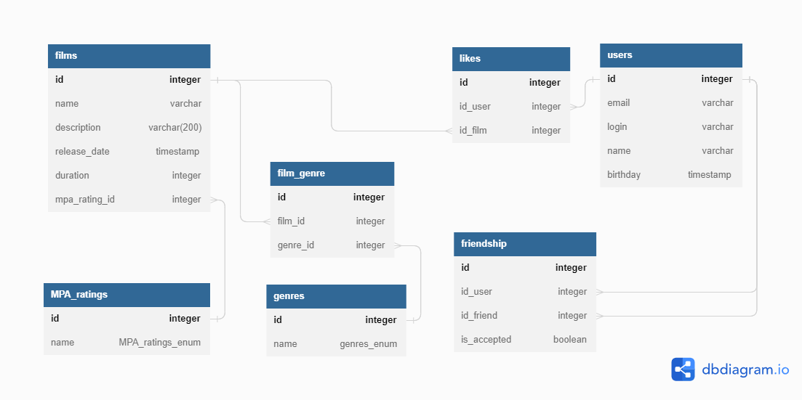

## Cхема Базы Данных filmorate.



### Таблицы.
- **films** - содержит информацию о фильмах.
- **film_genre** - связующая таблица. Нужна отображения связи многие-ко-многим.
- У каждого фильма может быть множество жанров. на film_id + genre_id стоит ограничение на уникальность (не должно быть повторов).
- **genres и MPA_ratings** - таблицы справочники. Содержат названия жанров фильмов и рейтингов.
- **users** - содержит информацию о пользователях.
- **likes** - содержит информацию о лайках. одна строка - один лайк фильму от одного пользователя.
- **friendship** - содержит информацию о друзьях.
    * id_user + id_friend - уникальная пара.
    * если is_accepted = TRUE, то это значит, что пользователь id_user добавил в друзья id_friend.
    * таблица дважды ссылается на одно поле (id) в таблице users.

### Примеры запросов.
- **films**\
  Получение информации о фильме происходит в два этапа.
    1. Получение данных из таблицы films + подтягивание рейтинга из MPA_ratings.
    ```sql
    SELECT f.id, f.name, f.description, f.release_date, f.duration, mr.id AS id_rating, mr.name AS name_rating
    FROM films f 
    LEFT JOIN MPA_ratings mr ON mr.id = f.mpa_rating_id;
    ```
    2. Сбор жанров фильма.
  ```sql
    SELECT f.id as id_film, g.id as id_genre, g.name as name_genre
    FROM films f
    LEFT JOIN film_genre fg ON fg.film_id = f.id
    LEFT JOIN genres g ON g.id = fg.genre_id;
    ```
  Добавление/обновление происходит схожим образом (в два этапа).


- **likes**\
  Получение информации о популярных фильмах (по кол-ву лайков).
    ```sql
    SELECT f.id as id_film, COUNT(l.id_user) AS likesCount
    FROM films f
    LEFT JOIN likes l ON l.id_film = f.id
    GROUP BY f.id
    ORDER BY likesCount DESC
    ```
- **friendship**\
  Получение списка друзей.
    ```sql
    SELECT id_friend 
    FROM friendship 
    WHERE id_user = ? AND is_accepted = TRUE;
    ```
